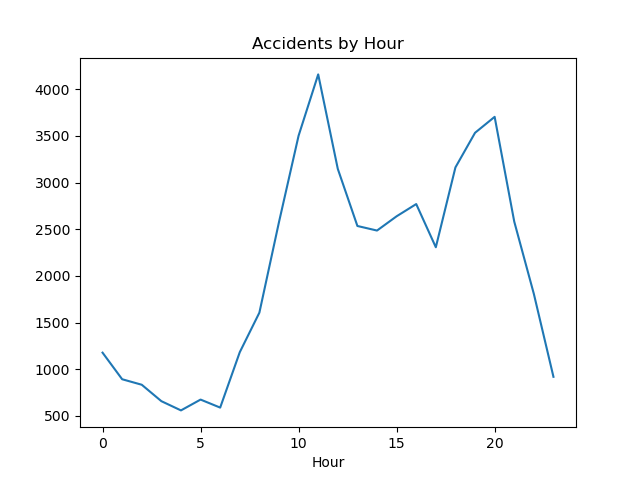
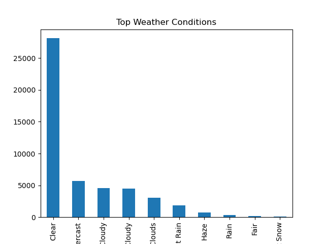
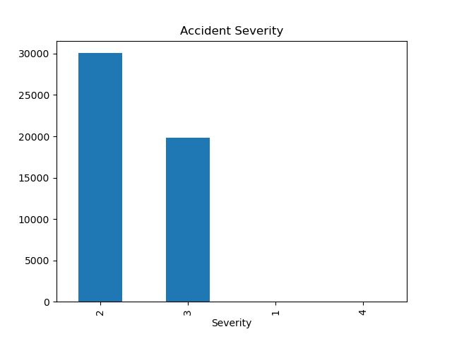
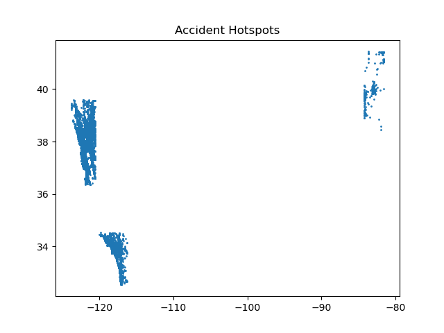

# PRODIGY_DS_05

## 📌 Internship Track
Data Science Internship at Prodigy InfoTech

---

## 📊 Task Objective
To analyze traffic accident data and identify patterns related to time of day, weather conditions, and severity. The goal is to understand contributing factors and visualize accident hotspots.

---

## 📁 Dataset
US Accidents Dataset (from Kaggle)

Due to the large size of the dataset (~3GB), a subset of the data was used for analysis.

---

## 🧹 Data Preprocessing

- Loaded dataset using Pandas with limited rows
- Selected relevant features:
  - Start Time
  - Severity
  - Weather Condition
  - Location (Latitude & Longitude)
- Converted time column to datetime format
- Extracted **hour** from timestamp for time-based analysis

---

## 📈 Exploratory Data Analysis

The following analyses were performed:

- Accidents distribution across different hours of the day  
- Impact of weather conditions on accidents  
- Severity distribution of accidents  

---

## 📍 Accident Hotspot Analysis

Geographical plotting was used to visualize accident-prone areas based on latitude and longitude.

---

## 📊 Visualizations

### ⏰ Accidents by Hour

### 🌧 Weather Conditions Impact

### ⚠️ Accident Severity

### 📍 Accident Hotspots

---

## 🔍 Key Insights

- Peak accident times occur during **morning and evening hours**  
- Certain weather conditions (e.g., rain, fog) are associated with higher accident frequency  
- Most accidents fall under moderate severity levels  
- Hotspot visualization reveals concentrated accident regions  

---

## 🛠 Tools & Technologies

- Python  
- Pandas  
- Matplotlib  

---

## 📂 Project Structure

PRODIGY_DS_05/

│

├── data/

│ └── accidents_sample.csv

│

├── notebooks/

│ └── task5_accident_analysis.ipynb

│

├── outputs/

│ ├── accidents_by_hour.png

│ ├── weather_conditions.png

│ ├── severity.png

│ └── hotspots.png

│

└── README.md

---

## ✅ Conclusion

This project demonstrates how data analysis can be used to uncover patterns in real-world traffic accidents. It highlights the importance of time, weather, and location in understanding accident trends and improving road safety strategies.

---

## 👤 Author
Godala Ashritha
